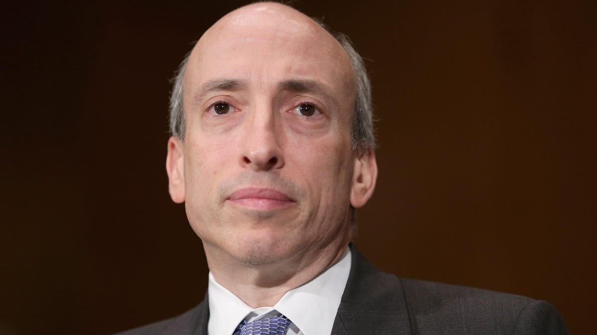

# general.md  

## General Notes:  

## References:  

## Website Links:  

## Main Exchanges:  

#### Market and Liquidity considerations:  

#### Total Market Capitalization - Growth Trends: 

## SEC Regulatatory Stands:  

 * What are they thinking?   

 * Chairman Gynsler?  
 * 

#### Total Market Capitalization - Growth Trends: 

## SEC Regulatatory Stands:  

 * What are they thinking?   

 * Chairman Gensler: 

Gary Gensler
Gary Gensler was nominated by President Joseph R. Biden to Chair the U.S. Securities and Exchange Commission on February 3, 2021, confirmed by the U.S. Senate on April 14, 2021, and sworn into office on April 17, 2021.
