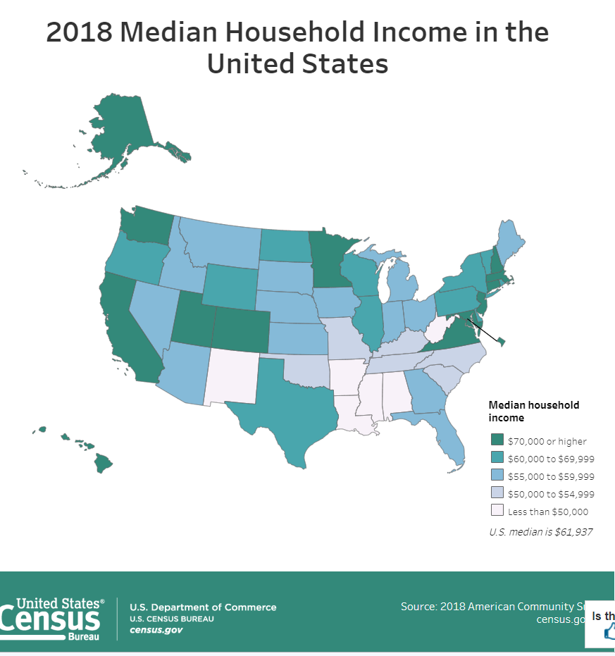

#  Download and add some data sets here.  

#### 1. Inequality - U.S. Census   

 Gini index is highest in US in 5 decades.  
 Number of people under $15,000 per year per family, is lowest ever.  
 But above $15,000 category increased much faster.  
 
 Information available from Census Data, show using US Map.  
 https://www.census.gov/topics/income-poverty/income-inequality.html  

https://www.census.gov/library/visualizations/interactive/2018-median-household-income.html  
Most states have 2 modes, $50-$75K and $80-$115K range. 

Can download data in various formats, including Tableau.  
Maps also available.  

Income and Poverty in the U.S.  
https://www.census.gov/library/publications/2019/demo/p60-266.html

Between 2017 and 2018, people aged 25 and older without a high school diploma was the only examined group to experience an increase in their poverty rate. Among this group, the poverty rate increased 1.4 percentage points, to 25.9 percent, but the number in poverty was not statistically different from 2017.  

Earnings:
Between 2017 and 2018, the real median earnings of all workers increased 3.4 percent to $40,247 (Figure 4 and Table A-6).
The 2018 real median earnings of men ($55,291) and women ($45,097) who worked full-time, year-round increased by 3.4 percent and 3.3 percent, respectively, (Figure 4 and Table A-6) between 2017 and 2018. The 2018 female-to-male earnings ratio was 0.816, not statistically different from the 2017 ratio.
The number of full-time, year-round workers increased by 2.3 million, between 2017 and 2018. The number of men and women full-time, year-round workers increased by about 700,000 and 1.6 million, respectively.

#### 1. Bureau of Labor Statistics  
https://www.bls.gov/  

Labor Force Participation Survey, Annual 2018.  
https://www.bls.gov/cps/tables.htm  
